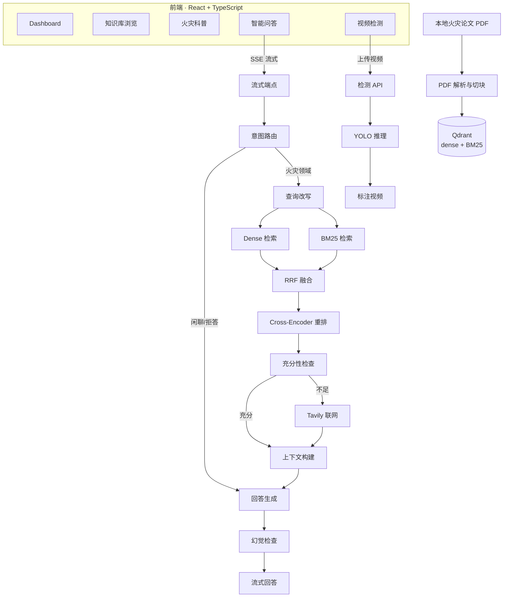

# FireAgent

面向火灾领域的 **RAG 专家问答 + 视频火灾检测** 系统。

以本地火灾论文 PDF 为知识来源，结合混合检索、重排、联网兜底和 LLM 生成，提供专业问答；同时集成 YOLO 视频火灾/烟雾检测能力。前端采用 React + TypeScript 可视化界面，支持 SSE 流式输出和多轮会话。

## 功能概览

| 模块 | 能力 |
|------|------|
| **智能问答** | 意图路由 · 查询改写 · Dense + BM25 混合检索 · RRF 融合 · Cross-Encoder 重排 · 证据充分性检查 · Tavily 联网兜底 · LLM 流式回答 · 幻觉检查 |
| **会话管理** | 多轮对话 · SQLite 短期记忆 · Qdrant 长期向量记忆（重要性评分 + 时间衰减） |
| **知识库** | PDF 解析（pdfplumber / MinerU）· 结构感知切块 · 元数据抽取 · Qdrant 向量入库 · 论文浏览与详情查看 |
| **视频检测** | YOLO 火灾/烟雾检测 · 视频上传 · 异步处理 · 结果视频回放与下载 |
| **前端界面** | Dashboard 统计 · 知识库浏览 · 火灾科普 · SSE 流式问答 · 视频检测 |
| **评测与可观测** | RAG 评测（规则化 + RAGAS）· 请求级 Trace 记录 · CI 流水线 |

## 系统架构



## 快速开始

### 环境要求

- Python 3.10+
- Node.js 18+
- Docker（用于 Qdrant，可选用于全栈部署）
- 可选：NVIDIA GPU（embedding / reranker 加速）
- 可选：Tavily API Key（联网兜底）
- 可选：OpenAI-compatible API Key（LLM 回答生成）

### 1. 配置环境变量

```bash
cp .env.example .env
```

编辑 `.env`，至少配置 Qdrant 地址。如需正式问答，配置 LLM 和 embedding 相关变量。

### 2. 启动 Qdrant

```bash
docker compose up -d qdrant
```

### 3. 启动后端

```bash
python -m venv .venv
source .venv/bin/activate        # Windows: .\.venv\Scripts\Activate.ps1
pip install -U pip
pip install -e ".[dev]"
uvicorn fireagent.api.server:app --host 0.0.0.0 --port 8000
```

### 4. 启动前端

```bash
cd frontend
npm install
npm run dev
```

访问 `http://localhost:3000`。

### 5. PDF 入库

```bash
# dry-run 验证解析
python scripts/ingest_pdfs.py --input-dir data/raw_pdfs --max-files 1 --max-pages 1 --dry-run

# 正式入库
python scripts/ingest_pdfs.py --input-dir data/raw_pdfs
```

## Docker 一键部署

准备好 `.env` 后，一条命令启动全部服务（后端 + 前端 Nginx + Qdrant）：

```bash
docker compose up -d --build
```

| 服务 | 地址 |
|------|------|
| 前端 | `http://localhost:3000` |
| 后端 API | `http://localhost:8000` |
| Qdrant Dashboard | `http://localhost:6333/dashboard` |

容器内 Nginx 自动托管前端静态文件并代理 API 请求，**服务器不需要安装宿主机 Nginx**。

```bash
docker compose ps     # 查看状态
docker compose down   # 停止服务
```

## 前端页面

| 路由 | 页面 | 说明 |
|------|------|------|
| `/` | Dashboard | 统计卡片、年份分布柱状图、关键词词云、快速提问 |
| `/knowledge` | 知识库 | 论文列表（搜索/筛选/分页）、详情侧滑面板 |
| `/science` | 火灾科普 | 6 大研究方向知识卡片、应急速查 |
| `/chat` | 智能问答 | SSE 流式输出、检索阶段可视化、引用来源、会话管理 |
| `/detect` | 视频检测 | 模型选择、视频上传、进度轮询、结果回放下载 |

## API 端点

### 问答与会话

| 方法 | 路径 | 说明 |
|------|------|------|
| `GET` | `/health` | 健康检查 |
| `POST` | `/chat` | 同步问答 |
| `POST` | `/chat/stream` | SSE 流式问答 |
| `POST` | `/sessions` | 创建会话 |
| `GET` | `/sessions` | 会话列表 |
| `PATCH` | `/sessions/{id}` | 更新会话标题 |
| `DELETE` | `/sessions/{id}` | 删除会话 |
| `GET` | `/sessions/{id}/messages` | 会话消息历史 |

### 知识库

| 方法 | 路径 | 说明 |
|------|------|------|
| `POST` | `/ingest` | PDF 批量入库 |
| `GET` | `/papers` | 论文列表（搜索/筛选/分页） |
| `GET` | `/papers/{doc_id}` | 论文详情 + 知识片段 |
| `GET` | `/papers/stats` | 知识库统计 |

### 视频检测

| 方法 | 路径 | 说明 |
|------|------|------|
| `GET` | `/detect/models` | 可用检测模型列表 |
| `POST` | `/detect/frame` | 单帧检测 |
| `POST` | `/detect/videos` | 上传视频（异步处理） |
| `GET` | `/detect/videos/{job_id}` | 查询任务状态 |
| `GET` | `/detect/videos/{job_id}/output` | 下载标注结果视频 |

## 模型配置

### Embedding

默认使用 `bge-m3` 通过 Ollama 调用：

```env
EMBEDDING_PROVIDER=ollama
EMBEDDING_MODEL_NAME=bge-m3
EMBEDDING_BASE_URL=http://localhost:11434
```

### Reranker

推荐 `FlagEmbedding` 本地加载 `bge-reranker-v2-m3`：

```env
RERANKER_PROVIDER=flagembedding
RERANKER_MODEL_NAME=models/bge-reranker-v2-m3
RERANKER_FALLBACK_TO_LEXICAL=true
```

### LLM

支持 OpenAI-compatible 接口（如通义千问、DeepSeek 等）：

```env
LLM_PROVIDER=openai_compatible
OPENAI_COMPATIBLE_BASE_URL=https://dashscope.aliyuncs.com/compatible-mode/v1
OPENAI_COMPATIBLE_API_KEY=your-key
OPENAI_COMPATIBLE_MODEL=qwen3.5-plus
ENABLE_LLM_ANSWER=true
```

### 视频检测模型

在 `configs/app.yaml` 的 `detection.models` 中配置，默认使用 YOLO：

```yaml
detection:
  models:
    yolo_fire_smoke:
      type: yolo
      weights_path: detect_models/your-model/weights/best.pt
      labels: ["fire", "smoke"]
```

## CLI 命令

```bash
# 单轮问答
python scripts/query_cli.py "隧道火灾烟气对人员疏散有什么影响"

# 交互模式
python scripts/query_cli.py

# 重建索引
python scripts/rebuild_index.py --input-dir data/raw_pdfs

# RAG 评测
python scripts/evaluate_rag.py --dataset data/eval/fireagent_benchmark_v1_seed10.jsonl --mode manual
```

## 项目结构

```text
FireAgent/
├── fireagent/                 # Python 后端
│   ├── api/                   # FastAPI 端点 + SSE 流式 + 检测 API
│   ├── graph/                 # LangGraph RAG 工作流（11 节点）
│   ├── retrieval/             # 混合检索、融合、重排、上下文构建
│   ├── ingestion/             # PDF 解析与切块
│   ├── vectorstore/           # Qdrant 向量库操作
│   ├── llm/                   # LLM 客户端（OpenAI-compatible）
│   ├── websearch/             # Tavily 联网搜索
│   ├── memory/                # 短期（SQLite）+ 长期（Qdrant）记忆
│   ├── detection/             # YOLO 视频检测
│   ├── evaluation/            # RAG 评测框架
│   ├── observability/         # 请求级 Trace
│   └── prompts/               # Prompt 模板
├── frontend/                  # React + TypeScript 前端
│   ├── src/
│   │   ├── api/               # API 调用 + SSE 解析
│   │   ├── components/        # 通用组件
│   │   ├── pages/             # 6 个页面
│   │   └── stores/            # Zustand 状态管理
│   ├── nginx.conf             # 生产 Nginx 配置
│   └── Dockerfile             # 多阶段构建
├── configs/                   # YAML 配置
├── scripts/                   # CLI 工具
├── tests/                     # 测试（30+ 文件）
├── docker-compose.yml         # 三服务编排
└── Dockerfile                 # 后端镜像
```

## 环境变量

完整变量见 [`.env.example`](.env.example)，核心变量：

| 变量 | 说明 | 默认值 |
|------|------|--------|
| `QDRANT_URL` | Qdrant 地址 | `http://localhost:6333` |
| `QDRANT_COLLECTION` | Collection 名称 | `fireagent_papers` |
| `OPENAI_COMPATIBLE_BASE_URL` | LLM 地址 | — |
| `OPENAI_COMPATIBLE_API_KEY` | LLM Key | — |
| `OPENAI_COMPATIBLE_MODEL` | LLM 模型名 | — |
| `EMBEDDING_PROVIDER` | Embedding 提供方 | `ollama` |
| `EMBEDDING_MODEL_NAME` | Embedding 模型 | `bge-m3` |
| `RERANKER_PROVIDER` | Reranker 提供方 | `flagembedding` |
| `RERANKER_MODEL_NAME` | Reranker 模型路径 | `models/bge-reranker-v2-m3` |
| `TAVILY_API_KEY` | Tavily Key（联网兜底） | — |
| `ENABLE_LLM_ANSWER` | 启用 LLM 回答 | `true` |
| `ENABLE_WEB_FALLBACK` | 启用联网兜底 | `true` |

配置加载顺序：`configs/*.yaml` → `.env` → 系统环境变量（优先级递增）。

## 测试

```bash
python -m pytest -q
```

覆盖：切块、检索融合、意图路由、上下文构建、检测 API、记忆系统、评测框架等。

## 技术栈

| 层 | 技术 |
|----|------|
| 后端 | Python · FastAPI · LangGraph · Qdrant · SQLite |
| 前端 | React 18 · TypeScript · Vite 5 · Tailwind CSS · Zustand · ECharts · Framer Motion |
| 模型 | bge-m3 (embedding) · bge-reranker-v2-m3 (reranker) · YOLO (detection) · OpenAI-compatible LLM |
| 部署 | Docker Compose · Nginx · GitHub Actions CI |

## 常见问题

**查询结果为空？** 

```
检查：Qdrant 是否启动、PDF 是否已入库、embedding 模型是否一致、collection 名称是否匹配。
```

**没有 Tavily Key 能用吗？** 

```
可以。只有本地证据不足时才需要联网兜底，未配置时会跳过并记录错误。
```

**切换 embedding 模型后？** 

```
更新 `EMBEDDING_MODEL_NAME` 和 `QDRANT_DENSE_VECTOR_SIZE`，然后 `python scripts/rebuild_index.py --input-dir data/raw_pdfs`。
```

## License

MIT
