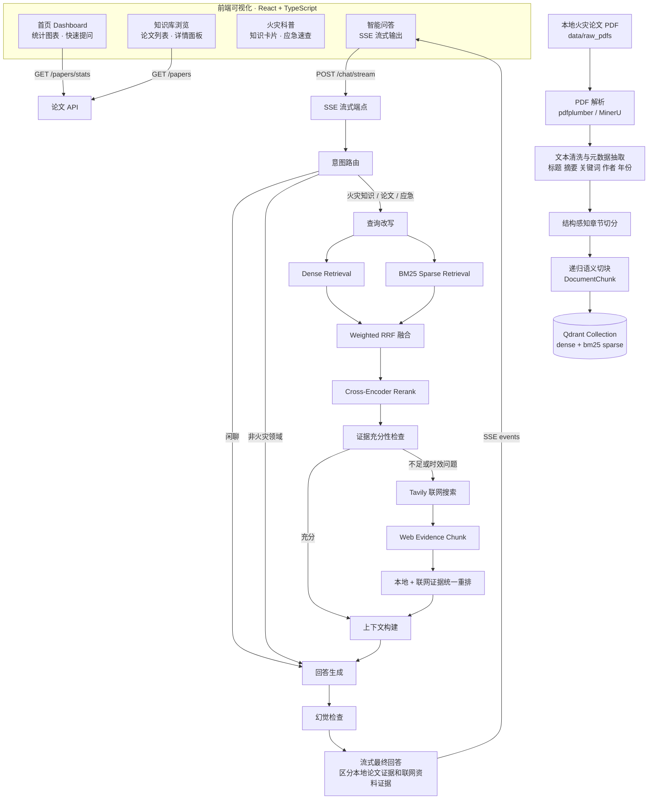

# FireAgent

FireAgent 是一个面向火灾领域论文知识库的专家问答系统。它以本地火灾论文 PDF 为主要知识来源，离线解析论文内容，进行结构感知切块和混合检索；当本地证据不足，或问题涉及最新政策、标准、法规、事故等时效信息时，使用 Tavily 联网搜索作为临时证据兜底。

当前项目已完成 MVP：

- PDF 解析、清洗、元数据抽取、章节切分、语义切块
- Qdrant dense vector + BM25 sparse vector 混合向量库
- dense retrieval + sparse retrieval + Weighted RRF 融合
- cross-encoder reranker 抽象与 lexical fallback
- 本地证据充分性检查
- Tavily 联网搜索兜底
- LangGraph 在线问答工作流
- Prompt 模板
- CLI 与 FastAPI
- pytest 测试
- 前端可视化界面（React + TypeScript + Tailwind CSS）
- SSE 流式问答输出
- 知识库浏览与论文详情查看
- 火灾知识科普与应急速查

## Quickstart

本地开发推荐先启动 Qdrant，再分别启动后端 API 和前端 Vite dev server。

1. 复制环境变量模板：

```powershell
Copy-Item .env.example .env
```

Linux / macOS：

```bash
cp .env.example .env
```

2. 启动 Qdrant：

```powershell
docker compose up -d qdrant
```

3. 启动后端 API：

```powershell
python -m venv .venv
.\.venv\Scripts\Activate.ps1
python -m pip install -U pip
python -m pip install -e ".[dev]"
uvicorn fireagent.api.server:app --host 0.0.0.0 --port 8000
```

Linux / macOS 激活虚拟环境使用：

```bash
source .venv/bin/activate
```

4. 启动前端：

```powershell
cd frontend
npm install
npm run dev
```

5. 访问服务：

- 前端开发地址：`http://localhost:3000`
- 后端健康检查：`http://localhost:8000/health`
- Qdrant：`http://localhost:6333`

如果只想先跑通链路，可以使用轻量配置或 hash embedding；正式问答需要在 `.env` 中配置 LLM、embedding、reranker，并完成 PDF 入库。

## Docker 一键启动

项目已提供后端、前端和 Qdrant 的 Docker Compose 编排。准备好 `.env` 后，可以一条命令启动整套服务：

```powershell
Copy-Item .env.example .env
docker compose up -d --build
```

Linux / macOS：

```bash
cp .env.example .env
docker compose up -d --build
```

启动后访问：

- 前端生产地址：`http://localhost:3000`
- 后端健康检查：`http://localhost:8000/health`
- Qdrant Dashboard：`http://localhost:6333/dashboard`

查看容器状态：

```powershell
docker compose ps
```

停止服务：

```powershell
docker compose down
```

Docker 模式下前端由容器内 Nginx 提供静态文件，并将 `/chat`、`/papers`、`/ingest`、`/health` 代理到后端 API；服务器不需要提前安装宿主机 Nginx。完整问答仍依赖 `.env`、模型服务、PDF 数据和已构建的 Qdrant 向量库。

## 系统架构



## 目录结构

```text
FireAgent/
├── configs/                 # YAML 配置
├── data/
│   ├── raw_pdfs/            # 输入 PDF
│   ├── parsed/              # 预留：解析中间结果
│   ├── chunks/              # 预留：切块中间结果
│   └── eval/                # 预留：评测数据
├── fireagent/
│   ├── api/                 # FastAPI + SSE 流式端点 + 论文 API
│   ├── graph/               # LangGraph 工作流
│   ├── ingestion/           # PDF 解析与切块
│   ├── llm/                 # LLM 客户端（含流式输出）
│   ├── prompts/             # Prompt 模板
│   ├── retrieval/           # 检索、融合、重排、上下文构建
│   ├── utils/               # 配置工具
│   ├── vectorstore/         # Qdrant 与 embedding
│   └── websearch/           # Tavily 联网搜索
├── frontend/                # React 前端可视化
│   ├── src/
│   │   ├── api/             # API 调用层 + SSE 解析
│   │   ├── components/      # 通用组件（布局、粒子动画、Markdown 渲染）
│   │   ├── pages/           # 页面（首页、知识库、问答、科普、关于）
│   │   ├── stores/          # Zustand 状态管理
│   │   └── utils/           # 工具函数
│   ├── package.json
│   ├── vite.config.ts
│   └── tailwind.config.js
├── scripts/                 # CLI 脚本
└── tests/                   # pytest
```

## 环境要求

- Python 3.10+
- Node.js 18+（前端构建）
- Docker 或本地 Qdrant 服务
- 可选：NVIDIA GPU，用于 embedding / reranker 模型加速
- 可选：Tavily API Key，用于联网兜底
- 可选：OpenAI-compatible API Key，用于正式 LLM 回答生成

建议使用干净虚拟环境，不建议直接安装到 Anaconda base 环境。

## 安装步骤

```bash
cd FireAgent
python -m venv .venv
```

Windows PowerShell：

```powershell
.\.venv\Scripts\Activate.ps1
```

Linux / macOS：

```bash
source .venv/bin/activate
```

安装依赖：

```bash
python -m pip install -U pip
python -m pip install -e ".[dev]"
```

如果只想先跑轻量 smoke test，可以暂时不下载大模型，入库和查询时使用 `--hash-embedding`。正式检索建议使用配置中的真实 embedding 模型。

## 启动 Qdrant

项目已提供 [docker-compose.yml](docker-compose.yml)：

```bash
docker compose up -d qdrant
```

默认地址：

```text
http://localhost:6333
```

查看容器状态：

```bash
docker compose ps
```

停止服务：

```bash
docker compose down
```

## 环境变量配置

复制示例配置：

```bash
cp .env.example .env
```

Windows PowerShell：

```powershell
Copy-Item .env.example .env
```

核心环境变量：

| 变量 | 说明 | 默认值 |
| --- | --- | --- |
| `QDRANT_URL` | Qdrant 服务地址 | `http://localhost:6333` |
| `QDRANT_API_KEY` | Qdrant API Key，本地可为空 | 空 |
| `QDRANT_COLLECTION` | Qdrant collection 名称 | `fireagent_papers` |
| `QDRANT_DENSE_VECTOR_SIZE` | dense 向量维度，`bge-m3` 默认 1024 | `1024` |
| `TAVILY_API_KEY` | Tavily 联网搜索 API Key | 空 |
| `OPENAI_COMPATIBLE_BASE_URL` | OpenAI-compatible LLM 地址 | 空 |
| `OPENAI_COMPATIBLE_API_KEY` | OpenAI-compatible API Key | 空 |
| `OPENAI_COMPATIBLE_MODEL` | LLM 模型名 | 空 |
| `ENABLE_LLM_ANSWER` | 是否启用正式 LLM 回答生成 | `true` |
| `LLM_PROVIDER` | LLM provider，目前支持 `openai_compatible` | `openai_compatible` |
| `PDF_PARSER` | PDF 解析器，支持 `pdfplumber` / `mineru` | `pdfplumber` |
| `MINERU_OUTPUT_DIR` | MinerU 结构化输出目录 | `data/parsed/mineru` |
| `MINERU_BACKEND` | MinerU 后端，常用 `pipeline` | `pipeline` |
| `MINERU_MODEL_SOURCE` | MinerU 模型源，常用 `local` / `modelscope` | 空 |
| `OLLAMA_BASE_URL` | Ollama 服务地址 | `http://localhost:11434` |
| `EMBEDDING_PROVIDER` | embedding provider，支持 `sentence_transformers` / `ollama` | `ollama` |
| `EMBEDDING_MODEL_NAME` | dense embedding 模型 | `bge-m3` |
| `EMBEDDING_BASE_URL` | embedding 服务地址，Ollama 时使用 | `http://localhost:11434` |
| `RERANKER_PROVIDER` | reranker provider，支持 `flagembedding` / `cross_encoder` / `ollama` / `lexical` | `flagembedding` |
| `RERANKER_MODEL_NAME` | reranker 模型或本地模型目录 | `FireAgent/models/bge-reranker-v2-m3` |
| `RERANKER_BASE_URL` | reranker 服务地址，Ollama 时使用 | `http://localhost:11434` |
| `CHUNK_SIZE` | 子 chunk 长度 | `800` |
| `CHUNK_OVERLAP` | 子 chunk overlap | `120` |
| `PARENT_CHUNK_SIZE` | parent chunk 长度 | `1800` |
| `DENSE_TOP_K` | dense 检索 top k | `30` |
| `SPARSE_TOP_K` | sparse 检索 top k | `30` |
| `FUSION_TOP_K` | RRF 融合候选数 | `50` |
| `RERANK_TOP_K` | 重排后保留数量 | `10` |
| `ENABLE_WEB_FALLBACK` | 是否启用联网兜底 | `true` |
| `EVAL_DATASET_PATH` | 默认评测集路径 | `data/eval/fireagent_eval_sample.jsonl` |
| `EVAL_OUTPUT_DIR` | 默认评测输出目录 | `data/eval/runs` |
| `EVAL_DEFAULT_MODE` | 默认评测模式：`manual` / `ragas` / `both` | `manual` |

配置加载规则：

1. 先读取 `configs/*.yaml`
2. 再读取 `.env`
3. 系统环境变量优先级最高

检查配置：

```bash
python -c "from fireagent.utils.config import get_config; print(get_config().model_dump())"
```

## 模型配置说明

默认模型：

- dense embedding：`bge-m3`，默认通过 Ollama 调用
- reranker：`bge-reranker-v2-m3`，默认通过 `FlagEmbedding` 从本地目录加载
- LLM：OpenAI-compatible Chat Completions API

配置位置：

- [configs/models.yaml](configs/models.yaml)
- `.env` 中的 `EMBEDDING_MODEL_NAME`
- `.env` 中的 `RERANKER_MODEL_NAME`
- `.env` 中的 `OPENAI_COMPATIBLE_BASE_URL`
- `.env` 中的 `OPENAI_COMPATIBLE_API_KEY`
- `.env` 中的 `OPENAI_COMPATIBLE_MODEL`

注意事项：

- `bge-m3` / `BAAI/bge-m3` 的 dense 向量维度通常为 1024，因此默认 `QDRANT_DENSE_VECTOR_SIZE=1024`。
- 如果切换 embedding 模型，必须同步修改 `QDRANT_DENSE_VECTOR_SIZE` 并重建 collection。
- 当前 reranker 支持 `FlagEmbedding`、`sentence-transformers CrossEncoder`、Ollama embedding 相似度重排和 lexical fallback。推荐生产问答使用 `FlagEmbedding + 本地模型目录`，这样是真正的 cross-encoder 重排；如果依赖或模型不可用，会回退到 lexical reranker，便于开发验证。
- 当前已经接入正式 `BaseLLMClient`，支持 OpenAI-compatible `/chat/completions`。如果 LLM 调用失败，会回退到证据模板回答，并把错误写入 workflow state。

### 使用 Ollama embedding + 本地 reranker

推荐方案是：`bge-m3` embedding 继续走 Ollama，`bge-reranker-v2-m3` reranker 通过 `FlagEmbedding` 从本地目录加载：

```text
OLLAMA_BASE_URL=http://localhost:11434

EMBEDDING_PROVIDER=ollama
EMBEDDING_MODEL_NAME=bge-m3
EMBEDDING_BASE_URL=http://localhost:11434

RERANKER_PROVIDER=flagembedding
RERANKER_MODEL_NAME=models/bge-reranker-v2-m3
RERANKER_BASE_URL=http://localhost:11434
RERANKER_FALLBACK_TO_LEXICAL=true
```

Ollama 官方提供的是 embedding API：`POST /api/embed`。FireAgent 的 Ollama embedding 会调用该接口。Ollama 目前没有标准 rerank API，因此真正的 cross-encoder reranker 建议使用 `RERANKER_PROVIDER=flagembedding` 并把 `RERANKER_MODEL_NAME` 指向本地模型目录。

准备 embedding 模型后，建议先验证：

```bash
ollama list
ollama pull bge-m3
```

准备 reranker 离线模型，如果使用本地 reranker 模型，建议放到 `models/bge-reranker-v2-m3`，或通过 `.env` 的 `RERANKER_MODEL_NAME` 指向实际路径。保留 `RERANKER_FALLBACK_TO_LEXICAL=true` 可以在本地模型不可用时继续返回可解释的轻量重排结果。

### 使用 OpenAI-compatible LLM

`.env` 示例：

```text
LLM_PROVIDER=openai_compatible
OPENAI_COMPATIBLE_BASE_URL=https://dashscope.aliyuncs.com/compatible-mode/v1
OPENAI_COMPATIBLE_API_KEY=你的 API Key
OPENAI_COMPATIBLE_MODEL=qwen3.5-plus
OPENAI_COMPATIBLE_TEMPERATURE=0.1
OPENAI_COMPATIBLE_MAX_TOKENS=1200
ENABLE_LLM_ANSWER=true
```

回答生成节点会优先使用 `BaseLLMClient` 调用该接口；没有证据上下文、闲聊、拒答或 LLM 失败时，会使用安全的模板化回答。

## 准备 PDF

将从知网等来源下载的火灾领域论文 PDF 放入：

```text
data/raw_pdfs/
```

文件名推荐使用：

```text
论文题名_作者.pdf
```

例如：

```text
隧道火灾烟气控制研究_张三.pdf
```

这样元数据抽取器可以优先从文件名识别论文题名和作者，避免部分 CNKI PDF 元数据将学校名误识别为题名。

## PDF 入库命令

先做 dry-run，只解析和切块，不写入 Qdrant：

```bash
python scripts/ingest_pdfs.py --input-dir data/raw_pdfs --max-files 1 --max-pages 1 --dry-run
```

使用哈希 embedding 做开发入库：

```bash
python scripts/ingest_pdfs.py --input-dir data/raw_pdfs --max-files 3 --hash-embedding
```

正式入库：

```bash
python scripts/ingest_pdfs.py --input-dir data/raw_pdfs
```

使用 MinerU 增强结构解析：

```bash
python scripts/ingest_pdfs.py --input-dir data/raw_pdfs --parser mineru --dry-run
```

也可以通过 `.env` 固定切换：

```text
PDF_PARSER=mineru
MINERU_OUTPUT_DIR=data/parsed/mineru
MINERU_BACKEND=pipeline
MINERU_MODEL_SOURCE=local
```

MinerU 解析器会优先读取已有输出目录中的 `*_content_list_v2.json`，找不到时再运行 `mineru -p <pdf> -o <output> -b pipeline`，并依次兼容 `content_list_v2.json`、`content_list.json` 和 `middle.json`。

重建 Qdrant collection 并重新入库：

```bash
python scripts/rebuild_index.py --input-dir data/raw_pdfs
```

常用参数：

| 参数 | 说明 |
| --- | --- |
| `--input-dir` | PDF 输入目录 |
| `--pdf` | 指定单个 PDF，可重复传入 |
| `--max-files` | 最多处理多少个 PDF |
| `--max-pages` | 每个 PDF 最多解析多少页，调试时很有用 |
| `--parser` | 指定 PDF 解析器：`pdfplumber` 或 `mineru` |
| `--batch-size` | Qdrant upsert 批大小 |
| `--recreate` | 删除并重建 collection |
| `--dry-run` | 只解析，不写入 |
| `--hash-embedding` | 使用哈希 embedding 做开发验证 |
| `--json` | 输出 JSON 统计 |

## CLI 问答命令

单轮问答：

```bash
python scripts/query_cli.py "隧道火灾烟气对人员疏散有什么影响"
```

显示 JSON：

```bash
python scripts/query_cli.py "隧道火灾烟气对人员疏散有什么影响" --json
```

显示最终上下文：

```bash
python scripts/query_cli.py "隧道火灾烟气对人员疏散有什么影响" --show-context
```

交互模式：

```bash
python scripts/query_cli.py
```

如果入库时使用了 `--hash-embedding`，查询时也应使用：

```bash
python scripts/query_cli.py "隧道火灾烟气控制" --hash-embedding
```

## FastAPI 启动方式

启动服务：

```bash
uvicorn fireagent.api.server:app --host 0.0.0.0 --port 8000
```

也可以：

```bash
python -m fireagent.api.server
```

健康检查：

```bash
curl http://localhost:8000/health
```

问答：

```bash
curl -X POST http://localhost:8000/chat ^
  -H "Content-Type: application/json" ^
  -d "{\"query\":\"隧道火灾烟气对人员疏散有什么影响\",\"include_context\":false,\"include_debug\":true}"
```

Linux / macOS：

```bash
curl -X POST http://localhost:8000/chat \
  -H "Content-Type: application/json" \
  -d '{"query":"隧道火灾烟气对人员疏散有什么影响","include_context":false,"include_debug":true}'
```

API 入库 dry-run：

```bash
curl -X POST http://localhost:8000/ingest \
  -H "Content-Type: application/json" \
  -d '{"dry_run":true,"max_files":1,"max_pages":1}'
```

API 列表：

- `GET /health` — 健康检查
- `POST /chat` — 同步问答
- `POST /chat/stream` — SSE 流式问答
- `POST /ingest` — PDF 入库
- `GET /papers` — 论文列表（支持搜索、筛选、分页）
- `GET /papers/{doc_id}` — 论文详情（元数据 + 知识片段）
- `GET /papers/stats` — 知识库统计（论文数、年份分布、关键词频率）

## 前端可视化

FireAgent 提供基于 React + TypeScript 的可视化前端界面，包含以下页面：

- **首页 Dashboard**：知识库统计卡片、论文年份分布柱状图、关键词词云、快速提问入口
- **知识库浏览**：论文列表（搜索、筛选、分页）、论文详情侧滑面板（元数据 + 知识片段列表）
- **火灾知识科普**：6 大研究方向知识卡片（隧道火灾、森林防火、建筑消防、火灾检测、人员疏散、风险评估）、应急知识速查
- **智能问答**：SSE 流式打字机输出、检索阶段可视化、引用来源折叠展示、安全提醒

视觉设计采用暗色基调 + 火焰渐变色系 + 毛玻璃卡片 + 粒子背景动画。

### 安装前端依赖

```bash
cd frontend
npm install
```

### 开发模式

```bash
cd frontend
npm run dev
```

访问 `http://localhost:3000`，Vite 会自动将 API 请求代理到后端 `localhost:8000`。

### 生产构建

```bash
cd frontend
npm run build
```

构建产物输出到 `frontend/dist/`，可交给 Nginx 托管或放到 FastAPI 的 static 目录下。

### 前端技术栈

| 依赖 | 用途 |
| --- | --- |
| React 18 + TypeScript | UI 框架 |
| Tailwind CSS | 原子化样式 |
| ECharts + echarts-wordcloud | 图表与词云 |
| Framer Motion | 页面动画 |
| Zustand | 状态管理 |
| react-markdown | Markdown 渲染 |
| lucide-react | 图标库 |
| Axios | HTTP 客户端 |

### SSE 流式问答

前端通过 `POST /chat/stream` 发起 SSE 请求，后端逐阶段返回事件：

| 事件类型 | 说明 |
| --- | --- |
| `stage` | RAG 流程阶段（意图识别、查询改写、检索、融合、重排、充分性检查、联网搜索、上下文构建） |
| `token` | LLM 流式输出的每个 token |
| `done` | 回答完成，包含引用来源、意图、耗时 |
| `error` | 错误信息 |

## RAG 评测流程

评测集采用 JSONL，每行一条样本，示例文件：

```text
data/eval/fireagent_eval_sample.jsonl
```

字段说明：

| 字段 | 说明 |
| --- | --- |
| `case_id` | 样本唯一 ID |
| `question` | 用户问题 |
| `reference_answer` | 人工参考答案 |
| `reference_contexts` | 可选参考证据 |
| `expected_keywords` | 答案和上下文应覆盖的关键词 |
| `required_citation_substrings` | 引用中应包含的来源线索 |
| `intent` | 期望意图，例如 `rag` / `paper` / `emergency` |
| `tags` | 评测标签 |

默认人工/规则评测：

```bash
python scripts/evaluate_rag.py --dataset data/eval/fireagent_eval_sample.jsonl --mode manual
```

如果评测的是用哈希 embedding 建的开发索引：

```bash
python scripts/evaluate_rag.py --hash-embedding --limit 3
```

使用已有预测结果，不重新调用 FireAgent：

```bash
python scripts/evaluate_rag.py --predictions data/eval/runs/你的run/predictions.jsonl
```

输出目录中会生成：

| 文件 | 说明 |
| --- | --- |
| `predictions.jsonl` | 每条样本的答案、上下文、引用和错误 |
| `manual_scores.jsonl` | 规则化评分明细 |
| `manual_review.csv` | 适合人工复核和补充评分的表格 |
| `summary.json` | 本次运行汇总 |
| `ragas_report.json` | 使用 RAGAS 时生成 |

内置规则指标包括：

- `answer_keyword_recall`：答案关键词召回
- `context_keyword_recall`：上下文关键词召回
- `reference_overlap`：答案与参考答案的词项重叠
- `citation_score`：引用存在性和预期来源线索覆盖
- `groundedness_proxy`：答案句子是否能在上下文中找到词项支持
- `safety_score`：应急类问题是否包含安全提醒
- `overall_score`：加权综合分

人工复核建议见：

```text
data/eval/manual_rubric.md
```

RAGAS 是可选流程，先安装额外依赖：

```bash
pip install -e ".[eval]"
```

然后运行：

```bash
python scripts/evaluate_rag.py --mode both --ragas-metrics faithfulness,answer_relevancy,context_precision
```

RAGAS 的部分指标需要可用的评测 LLM。若 RAGAS 不可用，`--mode both` 会保留内置评测结果并在 `summary.json` 中记录提示；`--mode ragas` 会直接报错，便于 CI 明确失败。

## 工作流说明

LangGraph 工作流节点：

1. `intent_router_node`：意图路由
2. `query_rewrite_node`：查询改写
3. `dense_retrieve_node`：dense 检索
4. `sparse_retrieve_node`：BM25/sparse 检索
5. `fusion_node`：Weighted RRF 融合
6. `rerank_node`：cross-encoder rerank
7. `sufficiency_check_node`：本地证据充分性检查
8. `web_search_node`：Tavily 联网搜索兜底
9. `context_build_node`：上下文构建
10. `answer_generate_node`：证据约束回答生成
11. `hallucination_check_node`：轻量幻觉检查

直接运行工作流：

```python
from fireagent.graph import run_fireagent_workflow

result = run_fireagent_workflow("隧道火灾烟气对人员疏散有什么影响")
print(result["final_answer"])
```

## 检索策略

FireAgent 的检索流程：

1. 保留原始 query
2. 规则化查询改写，得到主查询和扩展查询
3. dense retrieval 和 BM25 sparse retrieval 分别召回
4. Weighted RRF 按 `chunk_id` 去重并融合
5. reranker 重排候选
6. sufficiency checker 判断本地证据是否足够
7. 证据不足或命中时效词时触发 Tavily
8. 本地证据和联网证据统一重排、去重、压缩
9. 最终回答明确区分本地论文证据和联网资料证据

默认 Weighted RRF 参数：

```text
dense_weight = 0.65
sparse_weight = 0.35
rrf_k = 60
dense_top_k = 30
sparse_top_k = 30
fusion_top_k = 50
rerank_top_k = 10
```

## Prompt 模板

Prompt 文件位于 [fireagent/prompts](fireagent/prompts)：

- `intent_router.md`
- `query_rewrite.md`
- `sufficiency_check.md`
- `answer_generation.md`
- `hallucination_check.md`

加载示例：

```python
from fireagent.prompts import PromptTemplateLoader

loader = PromptTemplateLoader()
prompt = loader.render(
    "answer_generation",
    user_query="隧道火灾烟气对人员疏散有什么影响",
    intent="rag",
    final_context="...",
    citations="...",
    safety_notice="",
)
```

## 测试

运行全部测试：

```bash
python -m pytest -q
```

当前测试覆盖：

- 切块不丢文本、chunk size 合理
- Weighted RRF 排序和去重
- 意图路由
- 上下文去重、parent 回填、联网/本地证据区分

## 常见问题

**1. 为什么没有 Tavily API Key 时仍能运行？**

可以运行本地 RAG、CLI、API 和测试。只有本地证据不足且需要联网兜底时，才需要 `TAVILY_API_KEY`。未配置时，错误会写入 workflow state 或 API 响应的 `errors` 字段。

**2. 为什么闲聊问题不需要 Qdrant？**

意图路由会先判断问题类型。`chat` 和 `reject` 会直接进入回答生成，不触发 Qdrant 检索。

**3. 为什么查询结果为空？**

常见原因：

- Qdrant 没有启动
- PDF 还没有入库
- 入库和查询使用的 embedding 不一致
- 切换模型后没有重建 collection
- `QDRANT_COLLECTION` 配置不一致

**4. 什么情况下使用 `--hash-embedding`？**

它只适合开发验证，用于没有下载 embedding 模型时快速跑通 Qdrant 写入和查询。正式效果请使用真实 embedding 模型，例如 `BAAI/bge-m3`。

**5. 切换 embedding 模型后需要做什么？**

更新：

```text
EMBEDDING_MODEL_NAME
QDRANT_DENSE_VECTOR_SIZE
```

然后重建索引：

```bash
python scripts/rebuild_index.py --input-dir data/raw_pdfs
```

**6. MinerU 是否已经可用？**

已经接入增强版 `MinerUPDFParser`。默认仍使用 `pdfplumber`，避免没有 MinerU 环境时影响入库；安装并准备好 MinerU 模型后，可以使用 `--parser mineru` 或 `PDF_PARSER=mineru` 切换。解析器会把 MinerU 的 `content_list_v2.json` / `content_list.json` / `middle.json` 映射成 `ParsedDocument`，并保留标题层级、页码、表格、图注和 bbox 元数据。

**7. 回答是否一定可信？**

系统会尽量基于 evidence 回答，并标注本地论文证据和联网资料证据。如果证据不足，会明确说明。涉及应急、法规、标准、政策和事故等高风险或时效内容时，应核对官方发布源，现场火灾应优先拨打 119 并撤离。

**8. 当前是否已经接入 LLM？**

已经接入。`fireagent/llm` 下提供了 `BaseLLMClient` 和 `OpenAICompatibleLLMClient`。`answer_generate_node` 会使用 `fireagent/prompts/answer_generation.md` 渲染 prompt，并调用 OpenAI-compatible `/chat/completions`。如果 LLM 不可用，会自动回退到模板回答。

**9. 如何启动前端可视化界面？**

需要先启动后端 API 服务，再启动前端开发服务器：

```bash
# 终端 1：启动后端
python -m fireagent.api.server

# 终端 2：启动前端
cd frontend
npm install
npm run dev
```

然后访问 `http://localhost:3000`。生产部署时使用 `npm run build` 构建静态文件，交给 Nginx 托管。

**10. 前端的流式输出是如何实现的？**

前端通过 `POST /chat/stream` 发起 SSE (Server-Sent Events) 请求，后端手动编排 RAG 工作流的各阶段，在每个阶段完成时发送 `stage` 事件，LLM 回答阶段通过 `generate_stream()` 逐 token 发送 `token` 事件，前端使用 `fetch + ReadableStream` 逐行解析 SSE 数据，实现打字机效果。

## 开发状态

已完成：

- 阶段 1-11：核心 RAG 流水线（PDF 解析、混合检索、重排、联网兜底、LangGraph 工作流）
- MinerU 增强结构解析
- 正式 LLM 接入（OpenAI-compatible + 流式输出）
- 本地 reranker 配置（FlagEmbedding + lexical fallback）
- RAG 评测流程（规则化 + RAGAS）
- 前端可视化界面（React + TypeScript + Tailwind CSS，含 5 个页面）

下一步建议：

- 增加 API 鉴权与异步入库任务
- 增加多轮对话会话管理
- 前端生产部署配置（Nginx 反向代理、Docker Compose 全栈）
